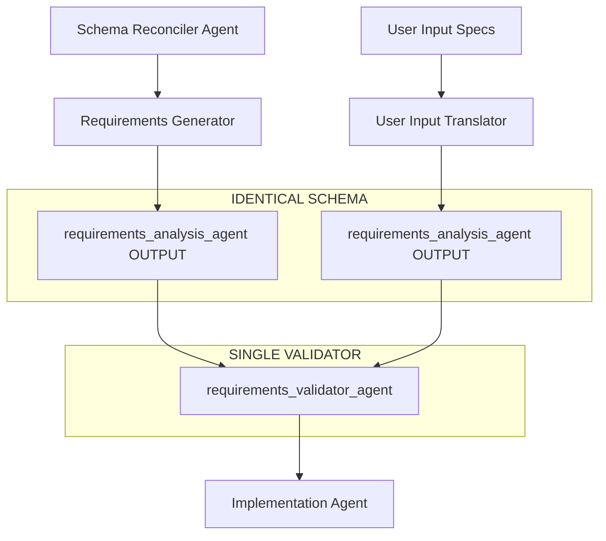

# 🔄 WARPCORE Unified Requirements Flow

**Updated**: 2025-10-07T07:23:00Z  
**Status**: **Schema Standardized** - Both input paths now produce identical output

---

## 🎯 **PROBLEM SOLVED**

✅ **requirements_generator.json** and **user_input_translator.json** now output **IDENTICAL schemas**  
✅ **requirements_validator.json** can seamlessly accept input from **either source**  
✅ **Dual-path workflow** supports both automated analysis and manual user input

---

## 📋 **UNIFIED OUTPUT SCHEMA**

### **Shared Schema Structure** (Both Agents)
```json
{
  "workflow_id": "string (from previous agent or user input)",
  "agent_name": "requirements_analysis_agent",           // ✅ IDENTICAL
  "source_agent_type": "requirements_generator|user_input_translator",
  "input_analysis": {
    "source_agent": "schema_coherence_reconciler_agent|USER_INPUT",
    "coherence_issues_count": "number (0 if user input)", 
    "fake_markers_total": "number (0 if user input)",
    "user_requirements_received": "array of strings (empty if schema-generated)"
  },
  "requirements_summary": { /* IDENTICAL STRUCTURE */ },
  "implementation_phases": { /* IDENTICAL STRUCTURE */ },
  "dependency_graph": { /* IDENTICAL STRUCTURE */ },
  "validation_metrics": { /* IDENTICAL STRUCTURE */ },
  "next_agent": "requirements_validator_agent"           // ✅ SAME TARGET
}
```

---

## 🔀 **DUAL INPUT FLOW**



---

## 🛤️ **PATH 1: Schema-Driven Analysis**

### **Workflow Chain**
```
Bootstrap Agent (0x) 
    ↓
Orchestrator Agent (0)
    ↓  
Schema Reconciler Agent (1) 
    ↓
Requirements Generator Agent (2) ── generates ──→ requirements_analysis_agent output
    ↓                                                        ↓
Requirements Validator Agent (3) ←──────── reads same schema ──┘
```

### **Data Flow**
```bash
# Input Cache Pattern
{workflow_id}_schema_coherence_analysis.json

# Processing
- 47 schema coherence issues identified
- 892 fake/demo markers requiring cleanup  
- AWS contamination removal requirements
- PAP compliance gaps addressed

# Output Cache Pattern  
{workflow_id}_requirements_analysis.json
```

---

## 🛤️ **PATH 2: User-Driven Requirements**

### **Workflow Entry**
```
User Input Specifications
    ↓
User Input Translator Agent ── generates ──→ requirements_analysis_agent output  
    ↓                                                    ↓
Requirements Validator Agent (3) ←──── reads same schema ──┘
```

### **Data Flow**  
```bash
# Input Cache Pattern
{workflow_id}_user_input_specifications.json

# Processing
- Natural language requirements parsed
- User priorities and constraints mapped  
- Technical specifications converted
- Implementation phases generated

# Output Cache Pattern (IDENTICAL TO PATH 1)
{workflow_id}_requirements_analysis.json
```

---

## 🔧 **REQUIREMENTS VALIDATOR COMPATIBILITY**

### **Single Input Handler**
The validator now handles **both input sources** transparently:

```json
{
  "input_cache_pattern": "{workflow_id}_requirements_analysis.json",
  "source_detection": {
    "schema_analysis": "coherence_issues_count > 0",
    "user_input": "user_requirements_received.length > 0"
  },
  "validation_focus_adaptation": {
    "if_schema_source": [
      "AWS contamination removal completeness",
      "Fake/demo code replacement coverage", 
      "PAP layer compliance validation"
    ],
    "if_user_source": [
      "User requirement satisfaction",
      "Implementation feasibility",
      "Timeline alignment with constraints"
    ]
  }
}
```

---

## 🎛️ **EXECUTION EXAMPLES**

### **Example 1: Schema Analysis Path**
```bash
# Run full automated analysis
python agency.py --workflow="gap_analysis" --mode="auto_discovery"

# Cache files created:
# 1. wf_abc123_schema_coherence_analysis.json     (from reconciler)
# 2. wf_abc123_requirements_analysis.json         (from generator) ✅ 
# 3. wf_abc123_requirements_validation.json       (from validator)
```

### **Example 2: User Input Path**  
```bash
# Run with user specifications
python agency.py --workflow="user_requirements" --input-file="my_specs.json"

# Cache files created:
# 1. wf_xyz789_user_input_specifications.json     (user input)
# 2. wf_xyz789_requirements_analysis.json         (from translator) ✅
# 3. wf_xyz789_requirements_validation.json       (from validator)
```

### **Example 3: Hybrid Path**
```bash
# Start with schema analysis, then add user requirements
python agency.py --workflow="hybrid" --schema-analysis --user-input="additional_specs.json"

# Both paths converge at validator with identical schema format
```

---

## ✅ **SCHEMA COMPATIBILITY VERIFICATION**

### **Key Standardization Points**

| Field | Requirements Generator | User Input Translator | Status |
|-------|----------------------|----------------------|---------|
| **agent_name** | `requirements_analysis_agent` | `requirements_analysis_agent` | ✅ **IDENTICAL** |
| **source_agent_type** | `requirements_generator` | `user_input_translator` | ✅ **DETECTED** |
| **input_analysis** | Schema + User fields | Schema + User fields | ✅ **UNIFIED** |
| **requirements_summary** | Full structure | Full structure | ✅ **IDENTICAL** |
| **implementation_phases** | 4 phases detailed | 4 phases detailed | ✅ **IDENTICAL** |
| **dependency_graph** | Full mapping | Full mapping | ✅ **IDENTICAL** |
| **next_agent** | `requirements_validator_agent` | `requirements_validator_agent` | ✅ **SAME TARGET** |

---

## 🚀 **BENEFITS ACHIEVED**

### **1. Flexible Entry Points**
- ✅ **Automated Discovery**: Schema reconciler → Requirements generator
- ✅ **Manual Specification**: User input → Requirements translator  
- ✅ **Hybrid Workflow**: Both sources can be combined

### **2. Single Validation Point**
- ✅ **Unified Processing**: One validator handles both input types
- ✅ **Consistent Output**: Same validation logic regardless of source
- ✅ **Simplified Maintenance**: Single schema to maintain

### **3. Source-Aware Processing**
- ✅ **Context Detection**: Validator adapts focus based on input source
- ✅ **Appropriate Validation**: Different criteria for schema vs user input
- ✅ **Preserved Intent**: Original source context maintained through workflow

---

## 🔄 **WORKFLOW DECISION MATRIX**

| Use Case | Path | Entry Point | Benefits |
|----------|------|-------------|----------|
| **Codebase Analysis** | Schema-Driven | Bootstrap → Schema Reconciler | Automated gap discovery, comprehensive analysis |
| **Feature Development** | User-Driven | User Input Translator | Direct requirements specification, faster start |
| **System Refactoring** | Schema-Driven | Bootstrap → Schema Reconciler | Identifies technical debt, PAP compliance |
| **Custom Implementation** | User-Driven | User Input Translator | Specific user requirements, business logic focus |
| **Maintenance Projects** | Either/Both | Flexible entry | Can analyze existing issues + add new requirements |

---

## 🎯 **NEXT STEPS**

1. **Test Both Paths** - Run workflows through each entry point
2. **Validate Schema Compatibility** - Confirm validator accepts both formats
3. **Document Usage Patterns** - Create guides for when to use each path  
4. **Implement Hybrid Mode** - Allow combining both input sources
5. **Add Source Detection** - Automatic validation focus adaptation

---

*This unified flow enables maximum flexibility while maintaining schema consistency and single-point validation.*