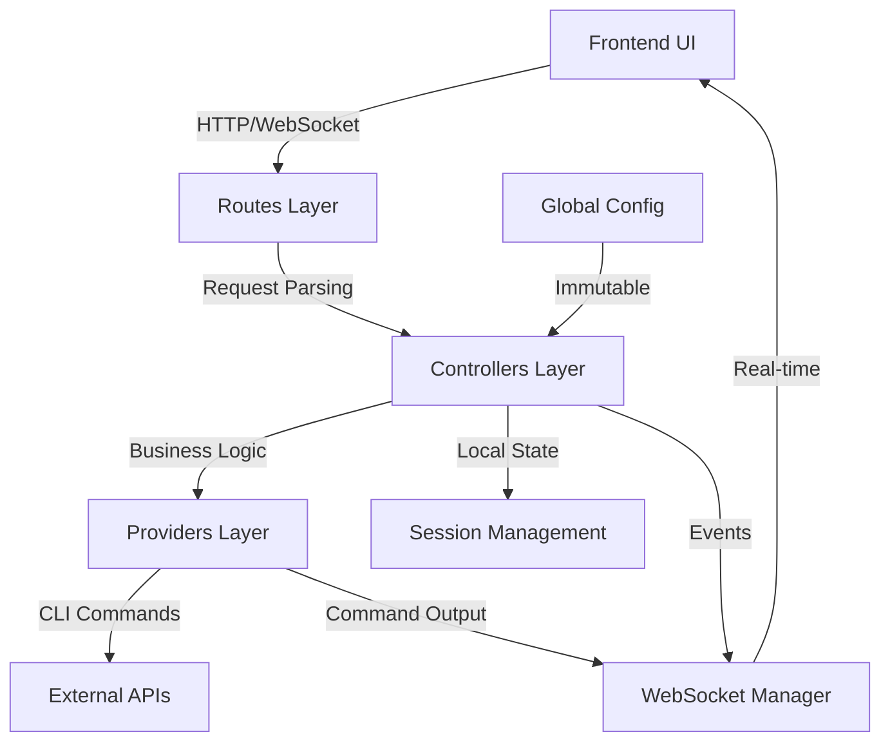

# waRpcoRE Architecture Documentation

WARP
ALWAYS FIX HARD CODED ACCOUNTS ID NAMES EMAILS YOU SEE IN DOCS
WARP

## 🏗️ Four-Tier Architecture Overview

waRpcoRE uses a four-tier architecture with global immutable config and local state management:

```
Routes → Controllers → Providers → External APIs
   ↓         ↓           ↓           ↓
HTTP      Business    CLI/API     AWS/GCP/K8s
Endpoints  Logic    Integration   Commands
```

## 📋 Architecture Components

### Layer 1: Routes (`web/routes/`)
- **Purpose**: HTTP endpoint definitions and request handling
- **Details**: See [`routes/README.md`](routes/README.md)
- **Examples**: AWS auth endpoints, command execution routes

### Layer 2: Controllers (`web/controllers/`) 
- **Purpose**: Business logic orchestration with local state
- **Details**: See [`controllers/README.md`](controllers/README.md)
- **Examples**: Environment validation, multi-provider coordination

### Layer 3: Providers (`web/providers/`)
- **Purpose**: Direct CLI/API integration with external services
- **Details**: See [`providers/README.md`](providers/README.md)
- **Examples**: AWS CLI execution, kubectl commands

### Layer 4: External APIs
- **Purpose**: Cloud services, CLI tools, system commands
- **Examples**: `aws sso login`, `gcloud auth list`, `kubectl get pods`

## 🌐 Global Config + Local State Pattern

### Global Immutable Config
- **Location**: `config/` directory + `web/config_loader.py`
- **Purpose**: Environment-agnostic configuration (AWS profiles, GCP projects)
- **Pattern**: Singleton, loaded once, never modified at runtime
- **Details**: See [`config/README.md`](config/README.md)

### Local State Management
- **Location**: Controller instances (`current_env`, `current_cloud`)
- **Purpose**: Runtime state (current environment, active sessions)
- **Pattern**: Mutable per-controller state for session management

## 🛠️ CLI Tools

### Main Entry Points
- **waRPCORe.py**: Master CLI with build/test/run commands
- **Build System**: Multi-platform compilation (Linux Docker + macOS)
- **Test Framework**: Shadow testing with Playwright
- **Details**: See [`cli/README.md`](cli/README.md)

## 📊 Data Flow Architecture



---

## 📝 Documentation Maintenance Instructions

**⚠️ CRITICAL: When core behaviors change, update documentation immediately using this checklist:**

### When Routes Change
- [ ] Update `routes/README.md` with new endpoints
- [ ] Add route examples to `routes/examples/`
- [ ] Update endpoint patterns in master doc
- [ ] Run `python3 llm-collector/run.py` to refresh codebase analysis

### When Controllers Change
- [ ] Update `controllers/README.md` with new business logic patterns
- [ ] Document state management changes
- [ ] Add controller examples to `controllers/examples/`
- [ ] Update data flow diagrams if coordination patterns change

### When Providers Change
- [ ] Update `providers/README.md` with new integrations
- [ ] Add CLI command examples to `providers/examples/`
- [ ] Document new external API patterns
- [ ] Update the External APIs section in master doc

### When Config System Changes
- [ ] Update `config/README.md` with new configuration patterns
- [ ] Document environment mapping changes
- [ ] Add config examples to `config/examples/`
- [ ] Update Global Config section in master doc

### When Build/CLI Changes
- [ ] Update `cli/README.md` with new commands
- [ ] Document build target changes (Docker/macOS/Linux)
- [ ] Add CLI usage examples to `cli/examples/`
- [ ] Update build architecture diagrams

### When Testing Framework Changes
- [ ] Update `testing/README.md` with new test patterns
- [ ] Document shadow testing changes
- [ ] Add test examples to `testing/examples/`
- [ ] Update fail-fast loop documentation

### Master Doc Updates Required For:
- [ ] **New Layers**: Add to four-tier architecture diagram
- [ ] **New Patterns**: Update architecture components section  
- [ ] **New Data Flows**: Update mermaid diagrams
- [ ] **New CLI Tools**: Update CLI tools section
- [ ] **Config Changes**: Update global config + local state pattern

### Documentation Validation Checklist
- [ ] Run `python3 llm-collector/run.py` after changes
- [ ] Verify all layer README.md files are updated
- [ ] Check that examples match current codebase behavior
- [ ] Validate mermaid diagrams render correctly
- [ ] Test documentation links work properly

---

## 🔄 Quick Navigation

- **Routes Layer**: [`routes/README.md`](routes/README.md) - HTTP endpoints, request handling
- **Controllers Layer**: [`controllers/README.md`](controllers/README.md) - Business logic, state management
- **Providers Layer**: [`providers/README.md`](providers/README.md) - CLI integration, command execution
- **Config System**: [`config/README.md`](config/README.md) - Global config, environment mapping
- **CLI Tools**: [`cli/README.md`](cli/README.md) - Build system, test framework, waRPCORe commands
- **Testing**: [`testing/README.md`](testing/README.md) - Shadow testing, fail-fast loops

---

## 📈 Architecture Benefits

✅ **Separation of Concerns**: Each layer has distinct responsibilities  
✅ **Testability**: Layers can be tested independently  
✅ **Extensibility**: New services follow established patterns  
✅ **Configuration Management**: Global immutable + local mutable state  
✅ **Real-time Communication**: WebSocket streaming throughout layers  
✅ **Multi-platform Support**: Docker + macOS + Linux compilation  

This architecture enables waRpcoRE to serve as a unified cloud operations command center while maintaining clean abstractions and extensible patterns.